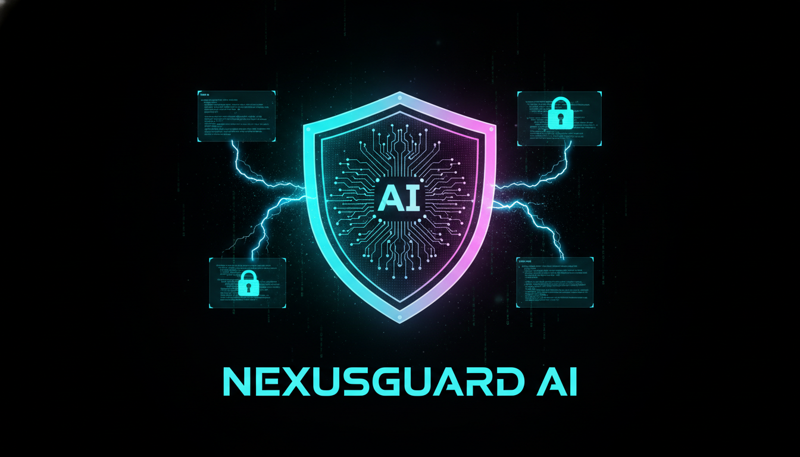

<div align="center">

# ⚡ NexusGuard AI

### *The Intelligent Reverse Proxy for AI-Powered Applications*

[](https://golang.org/)
[](LICENSE)
[]()
[]()
[-FFD700?style=for-the-badge)]()



**🛡️ Protect | 💰 Save | ⚡ Accelerate**

</div>

---

## 🔥 What is NexusGuard AI?

**NexusGuard AI** is an ultra-fast, zero-configuration local reverse proxy server built in Go. It sits elegantly between your code and any AI provider (OpenAI, Anthropic, Gemini, or local LLMs), providing enterprise-grade features that every AI developer needs:

- 💾 **Semantic Cache** — Save money by caching responses intelligently
- 🔒 **PII Masking** — Auto-detect and mask sensitive data before sending to APIs
- 💵 **Budget Defender** — Prevent runaway costs with configurable spending limits
- 🔄 **Smart Auto-Fallback** — Seamlessly failover when a provider goes down
- 📡 **Flawless Streaming** — SSE streaming works perfectly, word by word
- 🖥️ **Beautiful TUI Dashboard** — Monitor everything in a stunning terminal UI

> *"Change your base_url to `http://localhost:8080` and let the magic happen."*

---

## ✨ Features

| Feature | Description | Status |
|---------|-------------|--------|
| 🌐 **Universal AI Support** | OpenAI, Anthropic, Gemini, Local LLMs | ✅ Ready |
| 💾 **Semantic Cache** | BadgerDB-powered high-speed caching | ✅ Ready |
| 🔒 **PII Masking** | Auto-detect emails, phones, credit cards, SSNs | ✅ Ready |
| 💵 **Budget Defender** | Daily/monthly spending limits with hard stop | ✅ Ready |
| 🔄 **Smart Auto-Fallback** | Circuit breaker + health-checked failover | ✅ Ready |
| 📡 **Flawless Streaming** | Word-by-word SSE streaming preserved | ✅ Ready |
| 🖥️ **TUI Dashboard** | Real-time fighter-jet cockpit terminal UI | ✅ Ready |
| 📊 **REST API** | Stats endpoints for monitoring | ✅ Ready |
| 🚀 **Zero Config** | Works out of the box with sensible defaults | ✅ Ready |
| ⚡ **High Performance** | Sub-millisecond overhead, Go-powered | ✅ Ready |

---

## 🚀 Quick Start

### Installation

```bash
# Install directly with go install
go install github.com/smilespoon/nexusguard-ai/cmd/nexusguard@latest

# Or clone and build
git clone https://github.com/smilespoon/nexusguard-ai.git
cd nexusguard-ai
go build -o nexusguard ./cmd/nexusguard
```

### Basic Usage

**1. Set your API keys as environment variables:**

```bash
export OPENAI_API_KEY="sk-..."
export ANTHROPIC_API_KEY="sk-ant-..."
export GEMINI_API_KEY="..."
```

**2. Start the proxy:**

```bash
nexusguard
```

**3. Point your code to `http://localhost:8080`:**

---

## 💻 Usage Examples

### Python (OpenAI SDK)

```python
import openai

# Just change the base_url - that's it!
client = openai.OpenAI(
    api_key="your-api-key",
    base_url="http://localhost:8080/v1"  # ← Point to NexusGuard
)

# All your existing code works unchanged
response = client.chat.completions.create(
    model="gpt-4o",
    messages=[{"role": "user", "content": "Hello, how are you?"}],
    stream=True  # Streaming works flawlessly!
)

for chunk in response:
    if chunk.choices[0].delta.content:
        print(chunk.choices[0].delta.content, end="")
```

### JavaScript/TypeScript (OpenAI SDK)

```typescript
import OpenAI from 'openai';

const client = new OpenAI({
    apiKey: 'your-api-key',
    baseURL: 'http://localhost:8080/v1',  // ← Point to NexusGuard
});

// Streaming works perfectly
const stream = await client.chat.completions.create({
    model: 'gpt-4o',
    messages: [{ role: 'user', content: 'Hello!' }],
    stream: true,
});

for await (const chunk of stream) {
    process.stdout.write(chunk.choices[0]?.delta?.content || '');
}
```

### cURL (Direct API)

```bash
curl http://localhost:8080/v1/chat/completions \
  -H "Content-Type: application/json" \
  -H "Authorization: Bearer $OPENAI_API_KEY" \
  -d '{
    "model": "gpt-4o",
    "messages": [{"role": "user", "content": "Hello!"}]
  }'
```

### Go

```go
package main

import (
    "context"
    "fmt"
    "github.com/sashabaranov/go-openai"
)

func main() {
    client := openai.NewClientWithConfig(openai.ClientConfig{
        AuthToken: "your-api-key",
        BaseURL:   "http://localhost:8080/v1",
    })

    resp, err := client.CreateChatCompletion(
        context.Background(),
        openai.ChatCompletionRequest{
            Model: "gpt-4o",
            Messages: []openai.ChatCompletionMessage{
                {Role: "user", Content: "Hello!"},
            },
        },
    )

    if err == nil {
        fmt.Println(resp.Choices[0].Message.Content)
    }
}
```

---

## ⚙️ Configuration

NexusGuard works with **zero configuration**. Set these environment variables to customize:

```bash
# Server
export NEXUSGUARD_SERVER_PORT=8080

# Providers (keys are read from environment automatically)
export OPENAI_API_KEY="sk-..."
export ANTHROPIC_API_KEY="sk-ant-..."
export GEMINI_API_KEY="..."

# Budget
export NEXUSGUARD_BUDGET_DAILY_LIMIT=5.0        # $5/day limit
export NEXUSGUARD_BUDGET_MONTHLY_LIMIT=50.0     # $50/month limit
export NEXUSGUARD_BUDGET_HARD_STOP=true         # Block when exceeded

# Cache
export NEXUSGUARD_CACHE_ENABLED=true
export NEXUSGUARD_CACHE_TTL=24h

# Masking
export NEXUSGUARD_MASK_ENABLED=true
export NEXUSGUARD_MASK_EMAILS=true
export NEXUSGUARD_MASK_PHONES=true
export NEXUSGUARD_MASK_CREDIT_CARDS=true
```

### Configuration File

Create `nexusguard.yaml` in your project root:

```yaml
server:
  port: 8080
  read_timeout: 30s
  write_timeout: 120s

providers:
  - name: openai
    base_url: https://api.openai.com
    priority: 1
    enabled: true
    timeout: 60s
    retries: 3
    cost_per_1k_input: 0.0015
    cost_per_1k_output: 0.002

  - name: anthropic
    base_url: https://api.anthropic.com
    priority: 2
    enabled: true

  - name: gemini
    base_url: https://generativelanguage.googleapis.com
    priority: 3
    enabled: true

budget:
  enabled: true
  daily_limit: 5.0
  monthly_limit: 50.0
  warning_threshold: 0.8
  hard_stop: true

cache:
  enabled: true
  ttl: 24h
  max_size: 1073741824  # 1GB
  similarity_threshold: 0.95

mask:
  enabled: true
  mask_emails: true
  mask_phones: true
  mask_credit_cards: true
  mask_ssn: true
  placeholder: "[REDACTED]"

fallback:
  enabled: true
  timeout: 30s
  max_retries: 3
  circuit_breaker_threshold: 5
```

---

## 🖥️ TUI Dashboard

Launch the breathtaking terminal dashboard:

```bash
nexusguard --tui
```

The dashboard features:
- **Real-time metrics**: Money saved, total requests, PII masked, cache hits
- **Interactive controls**: Toggle features ON/OFF with arrow keys + Enter
- **Cyberpunk aesthetic**: Dark mode with cyan, magenta, and neon green accents
- **Provider status**: Live health indicators for all AI providers
- **Budget monitor**: Visual spending guard with warning colors

### Controls

| Key | Action |
|-----|--------|
| `↑` / `k` | Navigate up |
| `↓` / `j` | Navigate down |
| `Enter` / `Space` | Toggle selected feature |
| `h` | Show/hide help |
| `c` | Clear cache |
| `r` | Reset daily budget |
| `q` / `Ctrl+C` | Quit |

---

## 📊 Monitoring Endpoints

Access real-time statistics via REST API:

```bash
# Health check
curl http://localhost:8080/health

# Proxy statistics
curl http://localhost:8080/v1/proxy/stats

# Cache statistics
curl http://localhost:8080/v1/cache/stats

# Budget statistics
curl http://localhost:8080/v1/budget/stats

# PII masking statistics
curl http://localhost:8080/v1/mask/stats
```

---

## 🏗️ Architecture

```
┌─────────────────────────────────────────────────────────────┐
│                    YOUR APPLICATION                          │
│  (Python, JS, Go, Rust — anything with HTTP support)        │
└──────────────────────┬──────────────────────────────────────┘
                       │ base_url: http://localhost:8080
                       ▼
┌─────────────────────────────────────────────────────────────┐
│                  ⚡ NEXUSGUARD AI PROXY                      │
│                                                              │
│  ┌──────────────┐  ┌──────────┐  ┌──────────────────────┐  │
│  │ PII Masking  │→ │  Cache   │→ │ Budget Defender      │  │
│  │ (Protect)    │  │ (Save $) │  │ (Cost Control)       │  │
│  └──────────────┘  └──────────┘  └──────────────────────┘  │
│         │                 │ Miss          │ OK              │
│         ▼                 ▼               ▼                 │
│  ┌──────────────────────────────────────────────────────┐  │
│  │           Smart Auto-Fallback Router                 │  │
│  │   ┌──────────┐  ┌──────────┐  ┌──────────────────┐  │  │
│  │   │ OpenAI   │  │ Anthropic│  │ Gemini / Local   │  │  │
│  │   │ Primary  │  │ Fallback │  │ Fallback         │  │  │
│  │   └──────────┘  └──────────┘  └──────────────────┘  │  │
│  └──────────────────────────────────────────────────────┘  │
│                       │                                      │
│              ┌────────▼────────┐                             │
│              │ TUI Dashboard   │                             │
│              │ (Real-time UI)  │                             │
│              └─────────────────┘                             │
└─────────────────────────────────────────────────────────────┘
```

---

## 🧪 Development

```bash
# Clone the repository
git clone https://github.com/smilespoon/nexusguard-ai.git
cd nexusguard-ai

# Install dependencies
go mod tidy

# Run tests
go test ./...

# Build
go build -o nexusguard ./cmd/nexusguard

# Run with development settings
go run ./cmd/nexusguard --port 8080

# Run in daemon mode (no TUI)
go run ./cmd/nexusguard --daemon
```

---

## 🗺️ Roadmap

- [x] Universal AI Provider Support
- [x] Semantic Cache with BadgerDB
- [x] Bi-Directional PII Masking
- [x] Budget Defender
- [x] Smart Auto-Fallback
- [x] Flawless SSE Streaming
- [x] TUI Dashboard
- [ ] Web Admin Panel
- [ ] Request/Response Logging
- [ ] Custom Plugin System
- [ ] Multi-Region Load Balancing
- [ ] gRPC Support
- [ ] Prometheus Metrics Export
- [ ] Distributed Cache (Redis)

---

## 🤝 Contributing

Contributions are welcome! Please read our [Contributing Guide](CONTRIBUTING.md) for details on our code of conduct and the process for submitting pull requests.

1. Fork the repository
2. Create your feature branch (`git checkout -b feature/AmazingFeature`)
3. Commit your changes (`git commit -m 'Add some AmazingFeature'`)
4. Push to the branch (`git push origin feature/AmazingFeature`)
5. Open a Pull Request

---

## 📄 License

```
MIT License

Copyright (c) 2024 Mustafa Al-Aqrawi (Smile Spoon)

Permission is hereby granted, free of charge, to any person obtaining a copy
of this software and associated documentation files (the "Software"), to deal
in the Software without restriction, including without limitation the rights
to use, copy, modify, merge, publish, distribute, sublicense, and/or sell
copies of the Software, and to permit persons to whom the Software is
furnished to do so, subject to the following conditions:

The above copyright notice and this permission notice shall be included in all
copies or substantial portions of the Software.

THE SOFTWARE IS PROVIDED "AS IS", WITHOUT WARRANTY OF ANY KIND, EXPRESS OR
IMPLIED, INCLUDING BUT NOT LIMITED TO THE WARRANTIES OF MERCHANTABILITY,
FITNESS FOR A PARTICULAR PURPOSE AND NONINFRINGEMENT. IN NO EVENT SHALL THE
AUTHORS OR COPYRIGHT HOLDERS BE LIABLE FOR ANY CLAIM, DAMAGES OR OTHER
LIABILITY, WHETHER IN AN ACTION OF CONTRACT, TORT OR OTHERWISE, ARISING FROM,
OUT OF OR IN CONNECTION WITH THE SOFTWARE OR THE USE OR OTHER DEALINGS IN THE
SOFTWARE.
```

---

## 🙏 Acknowledgments

Crafted with ❤️ by **Mustafa Al-Aqrawi** ("Smile Spoon")

- Inspired by the amazing Go community
- Built with [Bubble Tea](https://github.com/charmbracelet/bubbletea) and [Lipgloss](https://github.com/charmbracelet/lipgloss)
- Powered by [BadgerDB](https://github.com/dgraph-io/badger)

<div align="center">

**[⬆ Back to Top](#-nexusguard-ai)**

*Made with ❤️ in the Middle East 🇮🇶*

</div>
